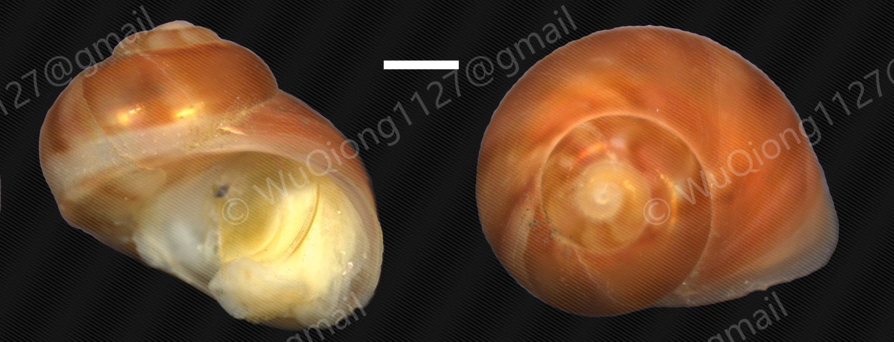

# *Glabracollonia laevigata*

[Back to the taxon index](index.md)

## Taxonomy

**Class:** Gastropoda  
**Family:** Colloniidae  
**Genus:** *Glabracollonia*  
**Species / taxon:** *Glabracollonia laevigata*  
**WoRMS AphiaID:**   [1643982](https://marinespecies.org/aphia.php?p=taxdetails&id=1643982)

## Distribution

**Recorded region:** East China Sea  
**Locality:** See the coordinates in the sampling records below.  
**Sampling-depth envelope:** 200–560 m  

Depth values describe substrate recovery. The range summarizes recorded samples.

## Organic-fall habitat

**Substrate:** Wood  
**Substrate organism:**   

## Sampling records

| Substrate Sample ID | Region | Substrate | Latitude | Longitude | Sampling depth (m) |
| --- | --- | --- | --- | --- | --- |
| 20250402X | East China Sea | Wood | 26°20′N | 123°50′E | 200 |
| 202521640409 | East China Sea | Wood | 28°20′N | 126°50′E | 400–560 |

## Material availability

- Voucher specimens:
- Tissue:
- DNA:
- RNA:

## Molecular resources

- COI: [PZ326583](https://www.ncbi.nlm.nih.gov/nuccore/PZ326583)
- 16S:
- 18S:
- 28S:
- H3:
- HSP70:
- Mitogenome: [PV591969](https://www.ncbi.nlm.nih.gov/nuccore/PV591969)
- Genome:
- Transcriptome:
- SRA: SRR35730924

## Images

**Representative image:**   
**Image type:**   

<!-- After uploading an image, uncomment this line: -->
<!--  -->

**Image credit:**   

## Publications

**Publications: Qiong Wu, Peng Xiang, Chun Guang Wang & Bing Peng Xing (2026) Characterization and phylogenetic analysis of the complete mitochondrial genome of Glabracollonia laevigata (Gastropoda: Trochida: Colloniidae) from East China Sea, Mitochondrial DNA Part B, 11:4, 536-540, DOI: 10.1080/23802359.2026.2642519**   

## Notes

**Notes:**   

<!-- Empty fields are retained for later editing. -->
