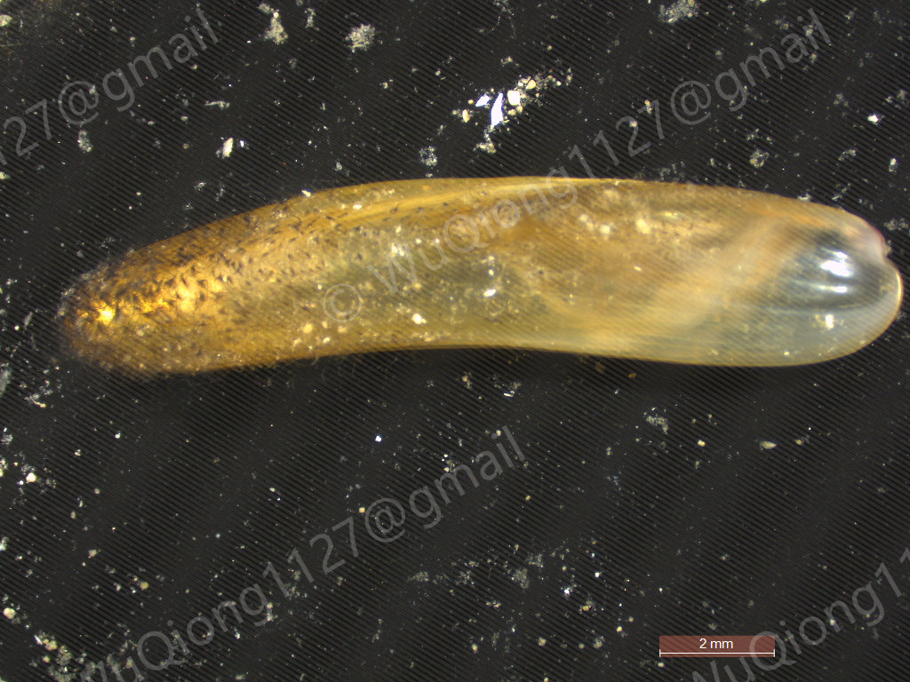

# *Idas iwaotakii*

[Back to the taxon index](index.md)

## Taxonomy

**Class:** Bivalvia  
**Family:** Modiolidae  
**Genus:** *Idas*  
**Species / taxon:** *Idas iwaotakii*  
**WoRMS AphiaID:**   

## Distribution

**Recorded region:** South China Sea; East China Sea  
**Locality:** See the coordinates in the sampling records below.  
**Sampling-depth envelope:** 100–560 m  

Depth values describe substrate recovery. The range summarizes recorded samples.

## Organic-fall habitat

**Substrate:** Wood  
**Substrate organism:**   

## Sampling records

| Sample ID | Region | Substrate | Latitude | Longitude | Sampling depth (m) |
| --- | --- | --- | --- | --- | --- |
| 2025PHI0409A | South China Sea | Wood | 10°40′N | 114°20′E | 300–500 |
| 2025PHI0506 | South China Sea | Wood | 10°20′N | 114°20′E | 300–500 |
| 20242085 | East China Sea | Wood | 28°50′N | 127°20′E | 480–560 |
| 20251224ES | East China Sea | Wood | 27°30′N | 122°10′E | 100–250 |
| 202419562503X | East China Sea | Wood | 29°40′N | 127°50′E | 420–460 |
| 2023181601 | East China Sea | Wood | 30°50′N | 127°50′E | 350–420 |

## Material availability

- Voucher specimens:
- Tissue:
- DNA:
- RNA:

## Molecular resources

- COI: [PP936108](https://www.ncbi.nlm.nih.gov/nuccore/PP936108)
- 16S:
- 18S: [PX115905](https://www.ncbi.nlm.nih.gov/nuccore/PX115905)
- 28S: [PX121785](https://www.ncbi.nlm.nih.gov/nuccore/PX121785)
- H3: [PX132889](https://www.ncbi.nlm.nih.gov/nuccore/PX132889)
- HSP70: [PX124069](https://www.ncbi.nlm.nih.gov/nuccore/PX124069)
- Mitogenome: [PV863430](https://www.ncbi.nlm.nih.gov/nuccore/PV863430)
- Genome:
- Transcriptome:

## Images

**Representative image:**   
**Image type:**   

<!-- After uploading an image, uncomment this line: -->
<!--  -->

**Image credit:**   

## Publications

**Publications:**   

## Notes

**Notes:**   

<!-- Empty fields are retained for later editing. -->
