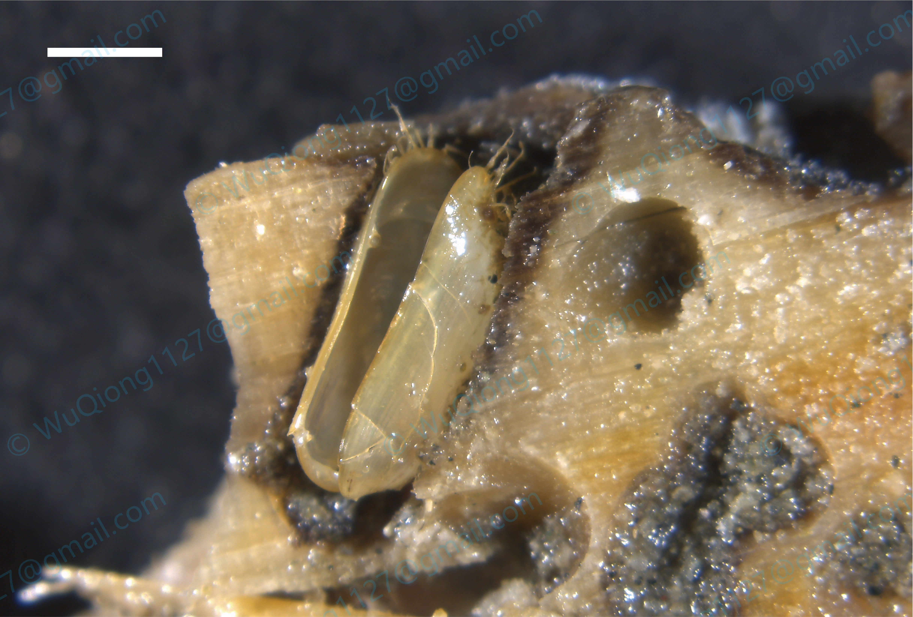

# *Idas pacificus*

[Back to the taxon index](index.md)

## Taxonomy

**Class:** Bivalvia  
**Family:** Modiolidae  
**Genus:** *Idas*  
**Species / taxon:** *Idas pacificus*  
**WoRMS AphiaID:** 1807815  

[View the WoRMS record](https://marinespecies.org/aphia.php?p=taxdetails&id=1807815)

## Distribution

**Recorded region:** South China Sea; East China Sea  
**Locality:** See the coordinates in the sampling records below.  
**Sampling-depth envelope:** 100–560 m  

Depth values describe substrate recovery. The range summarizes recorded samples.

## Organic-fall habitat

**Substrate:** Wood  
**Substrate organism:**   

## Sampling records

| Substrate Sample ID | Region | Substrate | Latitude | Longitude | Sampling depth (m) |
| --- | --- | --- | --- | --- | --- |
| 2025PHI0409A | South China Sea | Wood | 10°40′N | 114°20′E | 300–500 |
| 2025PHI0409B | South China Sea | Wood | 10°40′N | 114°20′E | 300–500 |
| 2025PHI0515 | South China Sea | Wood | 11°40′N | 116°40′E | 300–500 |
| 2025PHI0514 | South China Sea | Wood | 11°40′N | 116°40′E | 300–500 |
| 2025PHI0501 | South China Sea | Wood | 9°50′N | 114°20′E | 300–500 |
| 2025PHI0427 | South China Sea | Wood | 9°50′N | 114°20′E | 300–500 |
| 2025PHI0506 | South China Sea | Wood | 10°20′N | 114°20′E | 300–500 |
| 2025PHI0518 | South China Sea | Wood | 10°20′N | 114°20′E | 300–500 |
| 20242085 | East China Sea | Wood | 28°50′N | 127°20′E | 480–560 |
| 20251224ES | East China Sea | Wood | 27°30′N | 122°10′E | 100–250 |
| 202419562503X | East China Sea | Wood | 29°40′N | 127°50′E | 420–460 |
| 2024195625031 | East China Sea | Wood | 29°40′N | 127°50′E | 420–460 |
| 2025ES520 | East China Sea | Wood | 27°30′N | 122°10′E | 100–250 |
| 2024DHSW01 | East China Sea | Wood | 27°40′N | 121°20′E | 200 |
| 2024195601 | East China Sea | Wood | 29°40′N | 127°50′E | 420–460 |
| 2023181601 | East China Sea | Wood | 30°50′N | 127°50′E | 350–420 |

## Material availability

- Voucher specimens:
- Tissue:
- DNA:
- RNA:

## Molecular resources

- COI: [OR497041](https://www.ncbi.nlm.nih.gov/nuccore/OR497041)
- 16S:
- 18S: [PX115899](https://www.ncbi.nlm.nih.gov/nuccore/PX115899)
- 28S: [PX121793](https://www.ncbi.nlm.nih.gov/nuccore/PX121793)
- H3: [PX132887](https://www.ncbi.nlm.nih.gov/nuccore/PX132887)
- HSP70: [PX124073](https://www.ncbi.nlm.nih.gov/nuccore/PX124073)
- Mitogenome: [PQ541019](https://www.ncbi.nlm.nih.gov/nuccore/PQ541019)
- Genome:
- Transcriptome:

## Images

**Representative image:** `images/idas-pacificus/main.png`  
**Image type:**   
**Image credit:**   

## Publications

Wu, Q., Lin, Y.-T., Qiu, J.-W., Xu, M., & Xing, b. (2025). Two new species of Idas (Bivalvia: Mytilidae) from sunken wood in the East China Sea: description, phylogenetic position, symbionts, and mitochondrial genome. Zoosystematics and Evolution, 101(2), 761-778. https://doi.org/10.3897/zse.101.142007

## Notes

**Notes:**   

<!-- Empty fields are retained for later editing. -->
