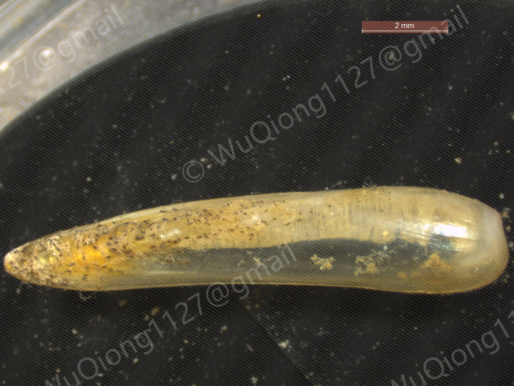

# *Idas sinensis*

[Back to the taxon index](index.md)

 

## Taxonomy

**Class:** Bivalvia  
**Family:** Modiolidae  
**Genus:** *Idas*  
**Species / taxon:** *Idas sinensis*  
**WoRMS AphiaID:**   [1807814](https://marinespecies.org/aphia.php?p=taxdetails&id=1807814)

## Distribution

**Recorded region:** South China Sea; East China Sea  
**Locality:** See the coordinates in the sampling records below.  
**Sampling-depth envelope:** 300–500 m  

Depth values describe substrate recovery. The range summarizes recorded samples.

## Organic-fall habitat

**Substrate:** Wood  
**Substrate organism:**   

## Sampling records

| Substrate Sample ID | Region | Substrate | Latitude | Longitude | Sampling depth (m) |
| --- | --- | --- | --- | --- | --- |
| 2025PHI0409A | South China Sea | Wood | 10°40′N | 114°20′E | 300–500 |
| 2023181601 | East China Sea | Wood | 30°50′N | 127°50′E | 350–420 |

## Material availability

- Voucher specimens:
- Tissue:
- DNA:
- RNA:

## Molecular resources

- COI: [PP936117](https://www.ncbi.nlm.nih.gov/nuccore/PP936117)
- 16S:
- 18S: [PX115904](https://www.ncbi.nlm.nih.gov/nuccore/PX115904)
- 28S: [PX121788](https://www.ncbi.nlm.nih.gov/nuccore/PX121788)
- H3: [PX132886](https://www.ncbi.nlm.nih.gov/nuccore/PX132886)
- HSP70: [PX124074](https://www.ncbi.nlm.nih.gov/nuccore/PX124074)
- Mitogenome: [PQ541016](https://www.ncbi.nlm.nih.gov/nuccore/PQ541016)
- Genome:
- Transcriptome:

## Images

**Representative image:**   
**Image type:**   

<!-- After uploading an image, uncomment this line: -->
<!--  -->

**Image credit:**   

## Publications

- Wu, Q., Lin, Y.-T., Qiu, J.-W., Xu, M., & Xing, b. (2025). Two new species of Idas (Bivalvia: Mytilidae) from sunken wood in the East China Sea: description, phylogenetic position, symbionts, and mitochondrial genome. Zoosystematics and Evolution, 101(2), 761-778. https://doi.org/10.3897/zse.101.142007
- Wu, Q., Zhou, Q., Xiang, P., Chen, Y., Wang, C. W., & Xing, B. (2026). Mitogenomic diversity and phylogenetic placement of organic-fall mussels (Bathymodiolinae) from the Chinese seas. Deep Sea Research Part I: Oceanographic Research Papers, 231, 104740. https://doi.org/10.1016/j.dsr.2026.104740 

## Notes

**Notes:**   

<!-- Empty fields are retained for later editing. -->
