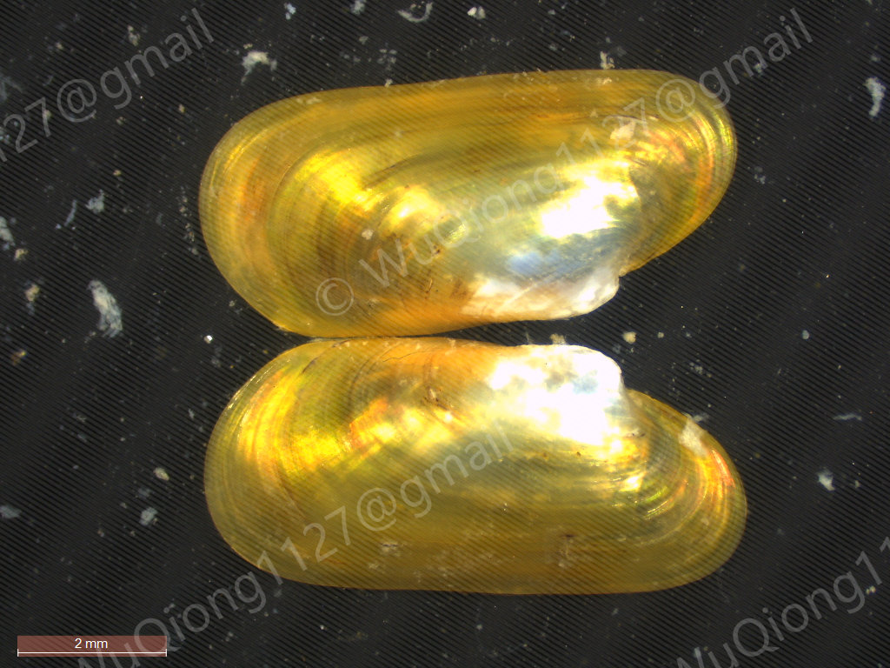

# *Terua pacifica*

[Back to the taxon index](index.md)

## Taxonomy

**Class:** Bivalvia  
**Family:** Modiolidae  
**Genus:** *Terua*  
**Species / taxon:** *Terua pacifica*  
**WoRMS AphiaID:**   [543974](https://marinespecies.org/aphia.php?p=taxdetails&id=543974)

## Distribution

**Recorded region:** East China Sea  
**Locality:** See the coordinates in the sampling records below.  
**Sampling-depth envelope:** 250–460 m  

Depth values describe substrate recovery. The range summarizes recorded samples.

## Organic-fall habitat

**Substrate:** Whale bone  
**Substrate organism:** Whale (species unspecified)  

## Sampling records

| Substrate Sample ID | Region | Substrate | Latitude | Longitude | Sampling depth (m) |
| --- | --- | --- | --- | --- | --- |
| 2025ESBone1 | East China Sea | Whale bone | 29°40′N | 127°50′E | 420–460 |
| 2025ESSmallBone1 | East China Sea | Whale bone | 29°40′N | 127°50′E | 420–460 |
| 202604Bone01 | East China Sea | Whale bone | 26°40′N | 125°20′E | 250 |

## Material availability

- Voucher specimens:
- Tissue:
- DNA:
- RNA:

## Molecular resources

- COI: [PZ326612](https://www.ncbi.nlm.nih.gov/nuccore/PZ326612)
- 16S:
- 18S: [PX115896](https://www.ncbi.nlm.nih.gov/nuccore/PX115896)
- 28S: [PX121779](https://www.ncbi.nlm.nih.gov/nuccore/PX121779)
- H3: [PX132883](https://www.ncbi.nlm.nih.gov/nuccore/PX132883)
- HSP70: [PX124064](https://www.ncbi.nlm.nih.gov/nuccore/PX124064)
- Mitogenome: [PV863431](https://www.ncbi.nlm.nih.gov/nuccore/PV863431)
- Genome:
- Transcriptome:

## Images

**Representative image:**   
**Image type:**   

<!-- After uploading an image, uncomment this line: -->
<!--  -->

**Image credit:**   

## Publications

**Publications:**   

## Notes

**Notes:**   

<!-- Empty fields are retained for later editing. -->
